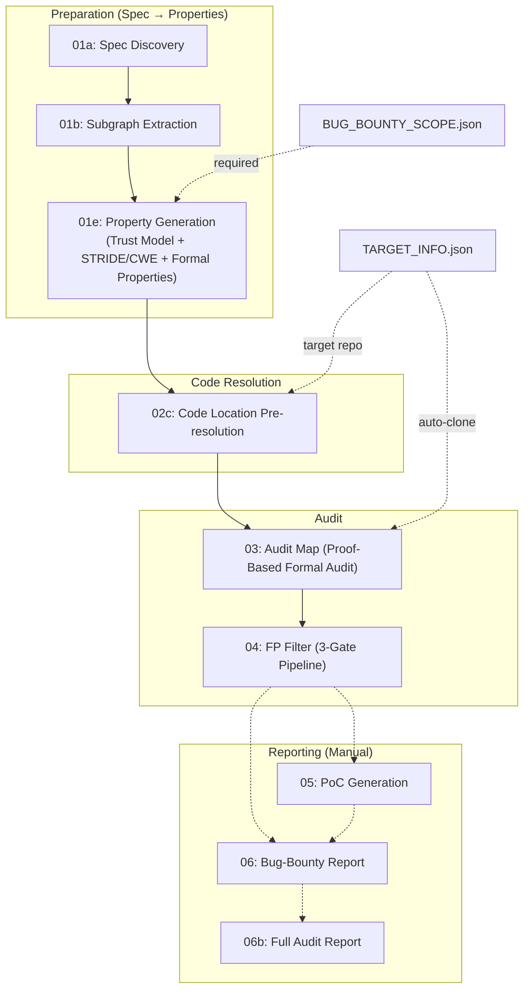

# SPECA: Specification-to-Checklist Agentic Auditing — Proposal

## 1. Introduction

This document outlines the latest progress, results, and future outlook for **SPECA (Specification-to-Checklist Agentic Auditing)**, our automated security analysis system.

SPECA converts natural-language specifications into audit checklists and systematically discovers vulnerabilities across multiple implementations.

Our paper, **"SPECA: Specification-to-Checklist Agentic Auditing for Multi-Implementation Systems — A Case Study on Ethereum Clients,"** was accepted to the **ICLR 2026 — Agents in the Wild Workshop**.

> **Paper abstract (abridged):**  
> Multi-implementation systems are increasingly audited against natural-language specifications. Differential testing scales well when implementations disagree, but it provides little signal when all implementations converge on the same incorrect interpretation of an ambiguous requirement. We present SPECA, a Specification-to-Checklist Auditing framework that turns normative requirements into checklists, maps them to implementation locations, and supports cross-implementation reuse. We instantiate SPECA in an in-the-wild security audit contest for the Ethereum Fusaka upgrade, covering 11 production clients. Across 54 submissions, 17 were judged valid by the contest organizers. Cross-implementation checks account for 76.5 percent (13 of 17) of valid findings, suggesting that checklist-derived one-to-many reuse is a practical scaling mechanism in multi-implementation audits. To understand false positives, we manually coded the 37 invalid submissions and find that threat model misalignment explains 56.8 percent (21 of 37): reports that rely on assumptions about trust boundaries or scope that contradict the audit's rules. We detected no High or Medium findings in the V1 deployment; misses concentrated in specification details and implicit assumptions (57.1 percent), timing and concurrency issues (28.6 percent), and external library dependencies (14.3 percent). Our improved agent, evaluated against the ground truth of a competitive audit, achieved a strict recall of 27.3 percent on high-impact vulnerabilities, placing it in the top 4 percent of human auditors and outperforming 49 of 51 contestants on critical issues. These results, though from a single deployment, suggest that early, explicit threat modeling is essential for reducing false positives and focusing agentic auditing effort. The agent-driven process enables expert validation and submission in about 40 minutes on average. [1]


## 2. SPECA Overview and Architecture

SPECA is a pipeline orchestrated in Python. Each phase runs workers in parallel with dedicated prompts to advance the audit automatically.

### 2.1. Pipeline Overview

The pipeline consists of three stages: **Preparation → Code Resolution → Audit**.



### 2.2. Design Evolution (V1 / V2 / V3)

|                     | V1                                                        | V2                                                       | V3                                                                                 |
|---------------------|-----------------------------------------------------------|----------------------------------------------------------|------------------------------------------------------------------------------------|
| **Design intent**   | Mimic expert white-hat workflow                           | Introduce formalization to improve checklist coverage    | STRIDE-driven gap reduction; inject formal methods thinking end-to-end             |
| **Spec understanding** | Spec → Property generated semi-manually with LLM          | Formalize spec via Program Graph (Nielson & Nielson)     | Program Graph + STRIDE/CWE Top 25 for domain-agnostic threat analysis              |
| **Property generation** | Experience-based checklist                               | Derive properties from formal subgraphs                  | Trust-model integration + reachability classes + bounty scope coupling             |
| **Audit method**    | Static analysis + pattern matching                        | Property-based formal audit                              | Proof-based 3-phase audit (Map → Prove → Stress-Test): “a broken proof is a bug”   |
| **FP suppression**  | Trust-boundary preset + reverse checklist                 | Same + formal rationale                                  | 3-Gate pipeline (Dead Code → Trust Boundary → Scope Check) + severity calibration  |
| **Result (Fusaka)** | 17 reports                                                | Re-run found 27% (High 2/3)                              | **100% recall** (15/15), FP rate ≤ 30%                                             |


## 3. V3 Agent Workflow Details

### 3.1. Preparation (Spec → Property)

#### Phase 01a: Specification Discovery

- **Goal:** Crawl and catalog relevant specs from a seed URL.
- **Prompt:** [`prompts/01a_crawl.md`](../prompts/01a_crawl.md)
- **Sample output (`outputs/01a_STATE.json`):**
```json
{
  "start_url": "https://github.com/ethereum/EIPs/blob/master/EIPS/eip-7594.md",
  "found_specs": [
    {
      "url": "https://github.com/ethereum/EIPs/blob/master/EIPS/eip-7594.md",
      "title": "EIP-7594: PeerDAS - Peer Data Availability Sampling",
      "category": "EIP",
      "type": "Standards Track / Core",
      "status": "Final",
      "layer": "consensus+networking",
      "description": "Introducing simple DAS utilizing gossip distribution and peer requests..."
    }
  ]
}
```

#### Phase 01b: Subgraph Extraction

- **Goal:** Extract formal “program graphs” from each spec and output them as Mermaid diagrams.
- **Prompt:** [`prompts/01b_extract_worker.md`](../prompts/01b_extract_worker.md)
- **Sample output (JSON):**
```json
{
  "specs": [
    {
      "source_url": "https://github.com/ethereum/EIPs/blob/master/EIPS/eip-7951.md",
      "title": "EIP-7951: Precompile for secp256r1 Curve Support",
      "sub_graphs": [
        {
          "id": "SG-001",
          "name": "p256verify_main",
          "mermaid_file": "outputs/graphs/W0B1_1770278556/EIP-7951/SG-001_p256verify_main.mmd"
        }
      ]
    }
  ]
}
```

#### Phase 01e: Property Generation

- **Goal:** Combine extracted program graphs with threat models (STRIDE/CWE Top 25) to automatically generate concrete security properties.
- **Prompt:** [`prompts/01e_prop_worker.md`](../prompts/01e_prop_worker.md)
- **Sample output (`outputs/01e_PARTIAL_*.json`):**
```json
{
  "properties": [
    {
      "property_id": "PROP-56ad1eb2-inv-001",
      "text": "P256VERIFY must accept valid secp256r1 signatures and reject all invalid ones deterministically.",
      "type": "invariant",
      "assertion": "forall (h,r,s,qx,qy): p256verify(h,r,s,qx,qy) == true iff ECDSA_verify(h,r,s,(qx,qy)) == true",
      "severity": "CRITICAL",
      "covers": "SG-003",
      "reachability": {
        "classification": "external-reachable",
        "entry_points": ["Transaction", "P2P"],
        "attacker_controlled": true,
        "bug_bounty_scope": "in-scope"
      }
    }
  ]
}
```

### 3.2. Code Resolution

#### Phase 02c: Code Location Pre-resolution

- **Goal:** For each property, pre-resolve relevant code locations (file path, symbol, line numbers) using Tree-sitter and grep, reducing token consumption in later phases by 40–60%.
- **Prompt:** [`prompts/02c_codelocation_worker.md`](../prompts/02c_codelocation_worker.md)
- **Sample output (`outputs/02c_PARTIAL_*.json`):**
```json
{
  "properties_with_code": [
    {
      "property_id": "PROP-56ad1eb2-inv-001",
      "code_scope": {
        "locations": [
          {
            "file": "core/vm/contracts.go",
            "symbol": "p256Verify.Run",
            "line_range": { "start": 1433, "end": 1449 },
            "role": "primary"
          }
        ],
        "resolution_status": "resolved"
      }
    }
  ]
}
```

### 3.3. Audit

#### Phase 03: Audit Map (Formal Audit)

- **Goal:** Apply a proof-based 3-stage audit (Map → Prove → Stress-Test) where broken proofs localize bugs.
- **Prompt:** [`prompts/03_auditmap_worker_inline.md`](../prompts/03_auditmap_worker_inline.md)
- **Sample output (when a vulnerability is found):**
```json
{
  "audit_items": [
    {
      "property_id": "PROP-6a4369e9-inv-042",
      "classification": "vulnerability",
      "code_path": "beacon-chain/verification/data_column.go::inclusionProofKey::L527-547",
      "proof_trace": "The cache key omits KzgCommitments (the data being proven), including only the inclusion proof and header hash. Two data columns with identical proofs/headers but different commitments produce the same cache key, causing the second to skip verification and reuse the first's cached result.",
      "attack_scenario": "Attacker sends valid DataColumnSidecar A, then sends forged DataColumnSidecar M with same inclusion proof and header but malicious KzgCommitments. Cache lookup succeeds on M's key, bypassing full Merkle verification and accepting invalid commitments.",
      "checklist_id": "PROP-6a4369e9-inv-042"
    }
  ]
}
```

#### Phase 04: FP Filter

- **Goal:** Use a three-gate pipeline (Dead Code, Trust Boundary, Scope Check) to systematically remove false positives from Phase 03 findings.
- **Prompt:** [`prompts/04_review_worker.md`](../prompts/04_review_worker.md)
- **Sample output (when classified as FP):**
```json
{
  "reviewed_items": [
    {
      "property_id": "PROP-6a4369e9-inv-010",
      "review_verdict": "DISPUTED_FP",
      "original_classification": "vulnerability",
      "adjusted_severity": "Informational",
      "reviewer_notes": "Phase 03 misunderstood the validation architecture. The array length validation DOES exist and IS enforced on all paths (gossip, RPC, and database loads). The claim of 'out-of-bounds panic' is false — the length check at kzg_utils.rs:84-89 prevents any indexing operation."
    }
  ]
}
```

## 4. Results and Evaluation

### 4.1. Sherlock Fusaka Audit Contest Evaluation

SPECA V3 discovered vulnerabilities (including ones missed by manual auditors) and achieved strong performance in the Sherlock audit contest.

Full evaluation logs are available in the repository’s GitHub Actions (see the Actions tab). Result artifacts are stored per client in dedicated branches; switch to the target branch to reproduce submissions and outputs.

- alloy_evm_fusaka: https://github.com/NyxFoundation/security-agent/tree/alloy_evm_fusaka
- rust_eth_kzg_fusaka: https://github.com/NyxFoundation/security-agent/tree/rust_eth_kzg_fusaka
- c_kzg_4844_fusaka: https://github.com/NyxFoundation/security-agent/tree/c_kzg_4844_fusaka
- grandine_fusaka: https://github.com/NyxFoundation/security-agent/tree/grandine_fusaka
- lodestar_fusaka: https://github.com/NyxFoundation/security-agent/tree/lodestar_fusaka
- reth_fusaka: https://github.com/NyxFoundation/security-agent/tree/reth_fusaka
- nimbus_fusaka: https://github.com/NyxFoundation/security-agent/tree/nimbus_fusaka
- nethermind_fusaka: https://github.com/NyxFoundation/security-agent/tree/nethermind_fusaka
- lighthouse_fusaka: https://github.com/NyxFoundation/security-agent/tree/lighthouse_fusaka
- prysm_fusaka: https://github.com/NyxFoundation/security-agent/tree/prysm_fusaka

| Metric       | Score                                   |
|--------------|-----------------------------------------|
| **Recall**   | 100% (15/15 ground-truth issues matched) |
| **Precision**| 66%                                     |
| **F1 Score** | 0.80                                    |

### 4.2. Examples of Detected Vulnerabilities

| Severity | Target     | Issue                                                                                          | Sherlock # |
|----------|------------|------------------------------------------------------------------------------------------------|------------|
| HIGH     | Prysm      | Inclusion proof cache key omits KzgCommitments — cache poisoning bypasses Merkle verification | #190       |
| HIGH     | Nethermind | Loop bound mismatch between `BlobVersionedHashes` and `wrapper.Blobs` — extra hash bypasses commitment verification | #210 |
| HIGH     | c-kzg-4844 | Fiat-Shamir challenge hash uses original array, not deduplicated — enables selective forgery   | #203       |
| MEDIUM   | Nimbus     | Infinite loop DoS in `handle_custody_groups` (via P2P metadata)                               | #15        |
| LOW      | Grandine   | Return value `Ok(false)` from `verify_kzg_proofs` ignored by `.map_err()?` — accepts invalid KZG proof | #376 |

### 4.3. Runtime Cost

| Phase              | Tokens/item | Time/item |
|--------------------|-------------|-----------|
| **03: Audit Map**  | 2.9M        | 119.6 sec |
| **04: FP Filter**  | 393K        | 22.0 sec  |

*item: one audit task for a single security property*

### 4.4. Benchmark Evaluation

To evaluate SPECA objectively, we define two quantitative tracks (RQ1, RQ2):

- **RQ1:** How many real contest bugs can we find compared to humans?
- **RQ2 (TODO):** How do we perform relative to traditional static analysis and fuzzing tools?

This clarifies SPECA’s position and guides continuous improvement.

## 5. Outlook (Milestones)

- **By end of March: Report and land fixes for new bugs**  
  - Finalize reports for additional bugs found in V3 re-runs and merge fix patches into each client branch. ([here](../benchmarks/results/rq1/sherlock_ethereum_audit_contest/unknown_review.csv))
- **By end of April: Quantitative comparisons (Static Analysis / Fuzzing / LLM tools)**  
  - Run benchmark comparisons against leading static analyzers, fuzzers, and LLM-based audit tools; publish reproducible procedures and results.
- **April–May: Integrate formal-verification agent**  
  - Integrate the Lean-based formal verification pipeline into the existing workflow to strengthen checklist generation and audit soundness.
- **In parallel: Build and use EVMBench (Ethereum Protocol Implementation edition)**  
  - Collect historically vulnerable code snippets from Ethereum protocol implementations, package them as an EVMBench variant, and use it for regression and tool-comparison benchmarks.

---

## References
[1] [SPECA: Specification-to-Checklist Agentic Auditing for Multi-Implementation Systems -- A Case Study on Ethereum Clients](https://arxiv.org/abs/2602.07513)
